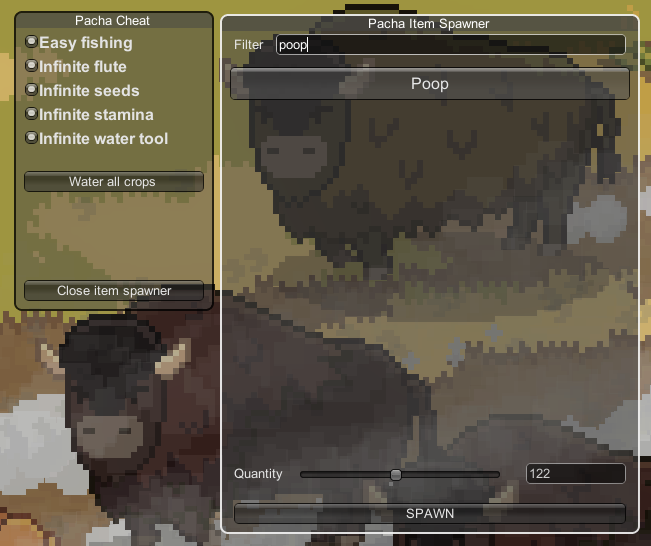

# Roots of Pacha Cheat Mod

This repository contains a cheat mod for Roots of Pacha game that can be used to enhance your gaming experience. Follow the steps below to install and use this mod:

## Prerequisites
- Roots of Pacha game installed on your computer
- [MelonLoader](https://github.com/LavaGang/MelonLoader) installed over Roots of Pacha game

## Installation
1. Install [MelonLoader](https://github.com/LavaGang/MelonLoader) or [BepInEx5](https://github.com/BepInEx/BepInEx/releases)
2. Download `CheatMod.[InstalledModFramework].zip` from the [release page](https://github.com/mzonski/roots-of-pacha-cheat-mod/releases)
3. Copy content from the output directory to the Roots of Pacha directory.
4. Run the game and enjoy the new features!

## Features
- Item spawner
- Instant catch
- Infinite flute usages
- Seeds don't decrease from pouch
- Infinite water tool
- Infinite stamina
- Forcefully cover tiles with stones/grass/sticks
- Skip disclaimer and intros
- Time manager (freeze time, set time)
- Player speedhack
- Insta grow crops (not working fully)

## Keys
| Key | Function                                                  |
|-----|-----------------------------------------------------------|
| F2  | Open cheat menu                                           |
| F3  | Add 5 charisma for a day                                  |
| F5  | Grow crops in 3f range                                    |
| F6  | Grow trees in 3f range                                    |
| F12 | Plant grass/rocks/trees over tiles (massive, be careful!) |
